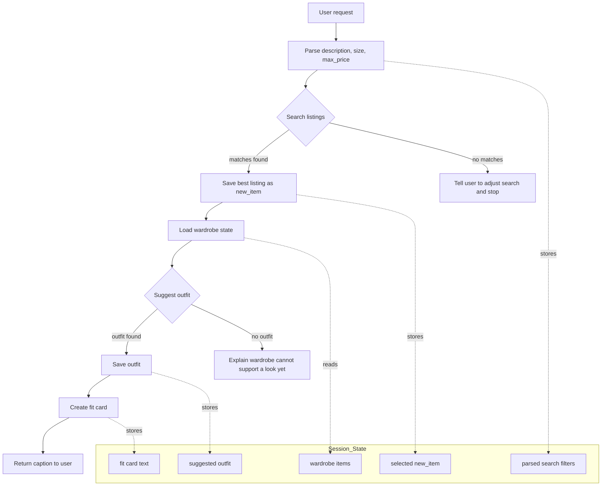

# FitFindr — planning.md

> Complete this document before writing any implementation code.
> Your spec and agent diagram are what you'll use to direct AI tools (Claude, Copilot, etc.) to generate your implementation — the more specific they are, the more useful the generated code will be.
> Your planning.md will be reviewed as part of your submission.
> Update it before starting any stretch features.

---

## Tools

List every tool your agent will use. For each tool, fill in all four fields.
You must have at least 3 tools. The three required tools are listed — add any additional tools below them.

### Tool 1: search_listings

**What it does:**
Searches the mock marketplace listings in `data/listings.json` and ranks items that match the user's request for item type, style, size, and budget. It is the first tool in the flow and decides which single listing is the best candidate to style.
<!-- Describe what this tool does in 1–2 sentences -->

**Input parameters:**
<!-- List each parameter, its type, and what it represents -->
- `description` (str): a text query describing the item the user wants, such as `vintage graphic tee` or `90s jeans`.
- `size` (str): the requested size to filter on, such as `S`, `M`, `L`, `XL`, `W30`, or `One Size`.
- `max_price` (float): the highest price the user is willing to pay.

**What it returns:**
Returns a list of the top matching listing dictionaries, sorted by relevance. Each result includes the listing fields from the dataset, such as `id`, `title`, `description`, `category`, `style_tags`, `size`, `condition`, `price`, `colors`, `brand`, and `platform`, so the next step can use the full listing record.
<!-- Describe the return value — what fields does a result contain? -->

**What happens if it fails or returns nothing:**
If no listings satisfy the filters, the agent stops after this step and tells the user to adjust the request, such as changing the size, loosening the price limit, or using a different description. It does not call `suggest_outfit` with an empty result.
<!-- What should the agent do if no listings match? -->

---

### Tool 2: suggest_outfit

**What it does:**
Builds an outfit around the selected new listing using the user's existing wardrobe from `data/wardrobe_schema.json`. The tool picks complementary items from the wardrobe and returns a complete outfit idea with styling context.

<!-- Describe what this tool does in 1–2 sentences -->

**Input parameters:**
<!-- List each parameter, its type, and what it represents -->
- `new_item` (dict): the selected marketplace listing from `search_listings`, including its title, category, size, colors, style tags, price, and other listing fields.
- `wardrobe` (dict): the user's closet object, shaped like the wardrobe schema and containing an `items` list of owned pieces with fields like `id`, `name`, `category`, `colors`, `style_tags`, and optional `notes`.

**What it returns:**
Returns a structured outfit object or list of outfit pieces that combines the new item with compatible wardrobe items. The result should identify what to wear together and include enough detail for the next tool to turn it into a caption, such as the chosen pieces, their categories, and brief styling notes.
<!-- Describe the return value -->

**What happens if it fails or returns nothing:**
If the wardrobe has no items, the agent explains that it cannot build an outfit yet and suggests adding wardrobe pieces before trying again. If no compatible outfit can be found, the agent reports that it could not pair the new item with the existing closet and stops instead of inventing pieces.
<!-- What should the agent do if the wardrobe is empty or no outfit can be suggested? -->

---

### Tool 3: create_fit_card

**What it does:**
Creates a short fit-card caption from the chosen outfit and the selected listing. The goal is a social-ready one- or two-sentence description that sounds like a user posting the look.
<!-- Describe what this tool does in 1–2 sentences -->

**Input parameters:**
<!-- List each parameter, its type, and what it represents -->
- `outfit` (dict): the outfit plan returned by `suggest_outfit`, including the selected pieces and any styling notes.
- `new_item` (dict): the marketplace listing that started the outfit, used so the caption can mention what the user thrifted or bought.

**What it returns:**
Returns a short caption string for the fit card, usually plain text that can be shown directly to the user. It should reference the outfit in a catchy, casual tone.
<!-- Describe the return value -->

**What happens if it fails or returns nothing:**
If the outfit data is missing key pieces, the agent should not generate a caption and should instead report that the outfit is incomplete. The user should be prompted to go back and pick a valid item or try another outfit suggestion.
<!-- What should the agent do if the outfit data is incomplete? -->

---

### Additional Tools (if any)

<!-- Copy the block above for any tools beyond the required three -->

---

## Planning Loop

**How does your agent decide which tool to call next?**
The agent first extracts the shopping intent from the user message: the item type or style, the requested size, and the maximum price. It always calls `search_listings` first, because the search result is the new item that everything else should be built around.

If `search_listings` returns nothing, the loop stops immediately and the agent tells the user to adjust the description, size, or price limit. If a listing is returned, the agent saves it as `new_item` and calls `suggest_outfit` with that listing plus the user's wardrobe.

If `suggest_outfit` cannot build a compatible outfit from the wardrobe, the loop stops and the agent explains that no valid outfit could be assembled yet. If an outfit is returned, the agent saves it as `outfit` and calls `create_fit_card` to generate the final caption. The loop ends once the caption is returned to the user.

---

## State Management

**How does information from one tool get passed to the next?**
<!-- Describe how your agent stores and accesses state within a session. What data is tracked? How is it passed between tool calls? -->
The agent keeps a small session state object with the parsed user request, the selected `new_item`, the user's wardrobe, the suggested `outfit`, and the final `fit_card` text. `search_listings` reads the marketplace listing schema, while `suggest_outfit` reads the wardrobe schema, so the agent stores the chosen listing separately and passes only the needed fields into the next tool.

The state flow is linear: parse the request, save the search filters, store the best listing returned by `search_listings`, pass that listing plus the wardrobe into `suggest_outfit`, then pass the returned outfit into `create_fit_card`. If any tool fails, the state does not advance and the agent returns the corresponding error message instead of inventing missing data.

---

## Error Handling

For each tool, describe the specific failure mode you're handling and what the agent does in response.

| Tool | Failure mode | Agent response |
|------|-------------|----------------|
| search_listings | No results match the query | Tell the user to adjust the description, size, or max price, then stop. |
| suggest_outfit | Wardrobe is empty | Explain that there are no wardrobe items to style and ask the user to add closet pieces first. |
| create_fit_card | Outfit input is missing or incomplete | Say the outfit is incomplete and do not generate a fit card until the outfit is fixed. |

---

## Architecture

---

## AI Tool Plan

<!-- For each part of the implementation below, describe:
     - Which AI tool you plan to use (Claude, Copilot, ChatGPT, etc.)
     - What you'll give it as input (which sections of this planning.md, your agent diagram)
     - What you expect it to produce
     - How you'll verify the output matches your spec before moving on

     "I'll use AI to help me code" is not a plan.
     "I'll give Claude my Tool 1 spec (inputs, return value, failure mode) and ask it to implement
     search_listings() using load_listings() from the data loader — then test it against 3 queries
     before trusting it" is a plan. -->

**Milestone 3 — Individual tool implementations:**
- I will use Copilot to implement each tool one at a time, starting with `search_listings` because it only depends on `load_listings()` from `utils/data_loader.py`.
- For `search_listings`, I will give the tool spec from the Tools section plus the example marketplace fields from `data/listings.json`, and I expect a function that filters by description, size, and max price and returns the best matching listing dictionaries.
- I will verify `search_listings` with at least three checks: one clear match, one borderline match, and one no-result case to confirm the failure path stops cleanly.
- Next, I will give Copilot the `suggest_outfit` spec, the wardrobe schema, and the example wardrobe from `data/wardrobe_schema.json`, and I expect it to build a valid outfit from the selected listing plus wardrobe items.
- I will verify `suggest_outfit` with a filled wardrobe and with `get_empty_wardrobe()` to confirm it returns an outfit in the first case and the empty-wardrobe failure path in the second.
- Finally, I will give Copilot the `create_fit_card` spec plus a sample outfit object, and I expect a short caption string that mentions the selected item and outfit vibe.
- I will verify `create_fit_card` by checking that it produces a short, readable caption and does not require extra missing fields.

**Milestone 4 — Planning loop and state management:**
- I will use Copilot to implement the planning loop after the tools are working, because the loop only needs to route between `search_listings`, `suggest_outfit`, and `create_fit_card`.
- I will give it the Planning Loop, State Management, Error Handling, and Architecture sections from this document so the control flow matches the spec and Mermaid diagram.
- I expect the loop to parse the user request, store `new_item` and `outfit` in session state, stop immediately when search returns nothing, and stop again if outfit creation fails.
- I will verify the loop with a full happy-path example and two failure-path examples: one where search returns nothing and one where the wardrobe cannot produce an outfit.
---

## A Complete Interaction (Step by Step)

Write out what a full user interaction looks like from start to finish — tool call by tool call. Use a specific example query.

**Example user query:** "I'm looking for a vintage graphic tee under $30. I mostly wear baggy jeans and chunky sneakers. What's out there and how would I style it?"

FitFindr should first search the marketplace listings for the best matching item using the user's size and price constraints. If a listing is found, it should use that listing as the `new_item` and combine it with the user's wardrobe `items` to suggest an outfit, then turn the final outfit into a short fit-card caption. If no listings match, it should explain what to change in the search and stop without calling `suggest_outfit`.

**Step 1:**
Call `search_listings(description="vintage graphic tee", size="M", max_price=30.0)`. This searches `data/listings.json` for marketplace items that match the request and returns the best few listings, already filtered by the tool's rules.
<!-- What does the agent do first? Which tool is called? With what input? -->

**Step 2:**
Take the top matching listing, for example `Faded Band Tee — $22, Depop, Good condition.` Use that listing as `new_item` and pass it together with the wardrobe object from `data/wardrobe_schema.json` into `suggest_outfit(new_item=..., wardrobe=...)`. If `search_listings` returns no results, stop here and tell the user to try a different size, price, or description.
<!-- What happens next? What was returned from step 1? What tool is called now? -->

**Step 3:**
Use the suggested outfit to call `create_fit_card(outfit=..., new_item=...)`. This generates the short, social-media-style caption that describes the full look in the user's voice.
<!-- Continue until the full interaction is complete -->

**Final output to user:**
A fit card caption, such as: "thrifted this faded band tee off depop for $22 and honestly it was made for my wide-legs 🖤 full look in my stories"
<!-- What does the user actually see at the end? -->
